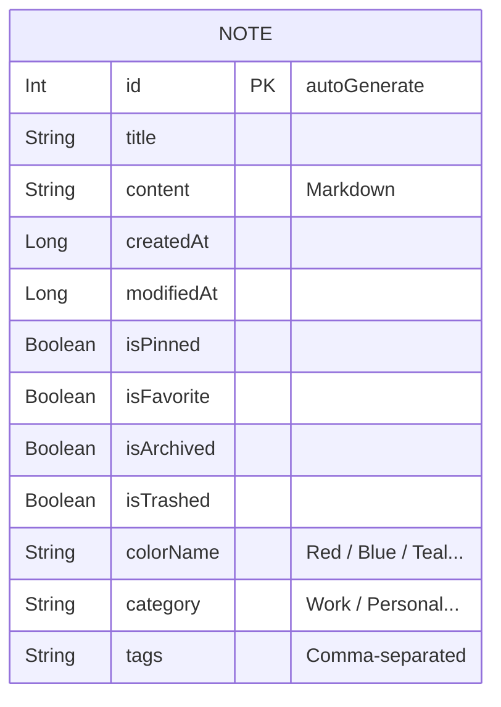
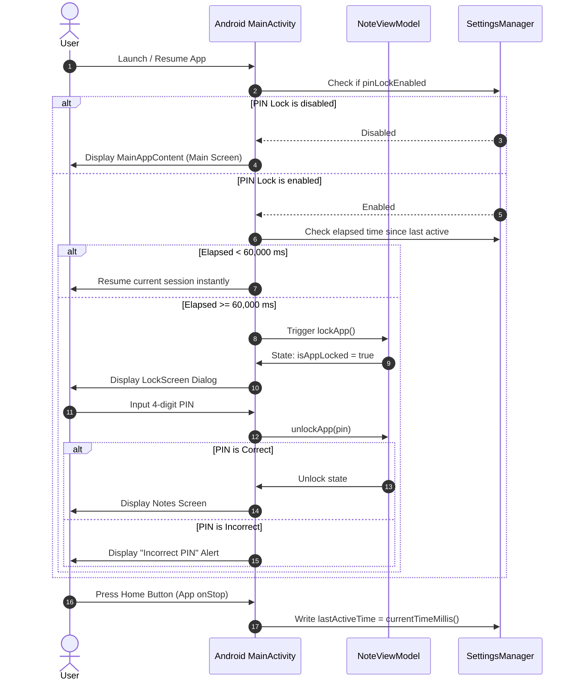

# Offline Notepad - App Architecture & Security Design

This document details the architectural design, database schemas, and security mechanisms of the Offline Notepad Android application. 

Offline Notepad is designed from the ground up as a **100% offline, privacy-first** application. All note creation, categorization, multi-profile switching, statistics compilation, and database storage occur strictly on-device.

---

## 1. System Architecture

The application is structured using standard **MVVM (Model-View-ViewModel)** pattern coupled with a clean repository layer. This ensures separation of concerns, high testability, and smooth reactive data streaming using Kotlin **Flow** and **Coroutines**.

### Architectural Flow Diagram

The following diagram illustrates how UI screens reactively observe state from the shared `NoteViewModel`, which coordinates data fetching from local `Room` database and app-wide configurations via `SettingsManager`.

```mermaid
graph TD
    %% Styling
    classDef ui fill:#D1F2D9,stroke:#1B4E28,stroke-width:2px;
    classDef vm fill:#D4E6FC,stroke:#183D5E,stroke-width:2px;
    classDef repo fill:#E9D1F5,stroke:#431F52,stroke-width:2px;
    classDef storage fill:#FFF7C2,stroke:#5A5215,stroke-width:2px;

    subgraph Presentation Layer [UI & Presentation]
        MainActivity[MainActivity] --> NavHost[Jetpack Compose NavHost]
        NavHost --> NoteListScreen[NoteListScreen]:::ui
        NavHost --> NoteEditorScreen[NoteEditorScreen]:::ui
        NavHost --> ArchiveScreen[ArchiveScreen]:::ui
        NavHost --> TrashScreen[TrashScreen]:::ui
        NavHost --> StatisticsScreen[StatisticsScreen]:::ui
        NavHost --> SettingsScreen[SettingsScreen]:::ui
        NavHost --> LockScreen[LockScreen]:::ui
        NavHost --> LoginScreen[LoginScreen]:::ui
    end

    subgraph State Management Layer [ViewModel]
        NoteViewModel[NoteViewModel]:::vm
    end

    subgraph Data Access Layer [Repository & DAO]
        NoteRepository[NoteRepository]:::repo
        SettingsManager[SettingsManager (SharedPreferences)]:::storage
    end

    subgraph Persistence Layer [Storage]
        NoteDatabase[NoteDatabase (Room)]:::storage
        NoteDao[NoteDao]:::repo
        SQLite[(Local SQLite Database)]:::storage
    end

    %% Interactions
    NoteListScreen & NoteEditorScreen & ArchiveScreen & TrashScreen & StatisticsScreen & SettingsScreen --> NoteViewModel
    NoteViewModel <--> NoteRepository
    NoteViewModel <--> SettingsManager
    NoteRepository <--> NoteDao
    NoteDao <--> NoteDatabase
    NoteDatabase <--> SQLite
```

---

## 2. Database Schema

The app uses **Jetpack Room** to map the `Note` Kotlin entity to a local SQLite database table named `notes`.

### Note Entity Properties

The properties of a note include support for markdown content, pinned state, favorited state, folder categories, tags, and theme color tags.

| Field Name | Data Type | Room Constraint / Default | Description |
| :--- | :--- | :--- | :--- |
| `id` | `Int` | `@PrimaryKey(autoGenerate = true)` | Unique auto-incremented note identifier |
| `title` | `String` | Not Null | Title of the note |
| `content` | `String` | Not Null | Content of the note (supports rich Markdown) |
| `createdAt` | `Long` | `System.currentTimeMillis()` | Timestamp of creation |
| `modifiedAt` | `Long` | `System.currentTimeMillis()` | Timestamp of last modification |
| `isPinned` | `Boolean` | `false` | Quick access pinning flag |
| `isFavorite` | `Boolean` | `false` | Bookmarked/Favorite flag |
| `isArchived` | `Boolean` | `false` | True if note is moved to Archive |
| `isTrashed` | `Boolean` | `false` | True if note is moved to Trash bin |
| `colorName` | `String` | `"Default"` | Background color tag (e.g. Red, Blue, etc.) |
| `category` | `String` | `"General"` | Custom or default folder category |
| `tags` | `String` | `""` | Comma-separated list of user tags |

### Room Entity Relationship Diagram (ERD)

Although the database operates locally with a single-table SQLite architecture to maintain rapid, transaction-free performance, the fields map structurally to logical note state relationships:



---

## 3. App Lock & Security Lifecycle

Security is enforced using a **4-digit PIN lock** option. The app records user interaction session bounds. If the application is backgrounded for more than **1 minute (60,000 ms)**, it automatically prompts the user with the lock screen upon being foregrounded.



---

## 4. Encrypted Backup & Restore

Backup and restore are performed entirely offline using **AES symmetric encryption**.
1. **Backup Process**:
   - The list of all notes is queried.
   - The records are serialized into a JSON structure.
   - If encrypted backup is selected, a password is requested.
   - A key is derived from the password using cryptographic derivation, and the JSON is encrypted using **AES**.
   - The resulting encrypted JSON payload is saved as an external `.json` file in the user's local Downloads directory.
2. **Restore Process**:
   - The user selects a backup `.json` file.
   - If it is encrypted, the user inputs the matching password.
   - The payload is decrypted, verified as valid JSON, parsed, and merged directly into the local `Room` database.

```mermaid
flowchart TD
    %% Styling
    classDef process fill:#D4E6FC,stroke:#183D5E,stroke-width:2px;
    classDef decision fill:#FFD1D1,stroke:#6B1B1B,stroke-width:2px;
    classDef storage fill:#FFF7C2,stroke:#5A5215,stroke-width:2px;

    %% Backup Flow
    subgraph BACKUP_FLOW [Export Backup Flow]
        A[Start Backup Request] --> B[Retrieve Notes from Room DB]:::process
        B --> C[Serialize Notes to JSON Array]:::process
        C --> D{Encrypt Backup?}:::decision
        D -- No --> E[Write Plain JSON to Downloads File]:::storage
        D -- Yes --> F[Request Encryption Password]
        F --> G[Derive AES Key]:::process
        G --> H[Encrypt JSON with AES]:::process
        H --> I[Write Encrypted JSON to Downloads File]:::storage
    end

    %% Restore Flow
    subgraph RESTORE_FLOW [Import Restore Flow]
        J[Select Backup File] --> K{Is Encrypted?}:::decision
        K -- No --> L[Parse Plain JSON Array]:::process
        K -- Yes --> M[Request Decryption Password]
        M --> N[Derive AES Key]:::process
        N --> O[Decrypt File Payload using AES]:::process
        O --> L
        L --> P[Validate JSON Structure]:::process
        P --> Q[Insert / Merge Notes into Room SQLite]:::storage
        Q --> R[Toast: Restore Completed]
    end
    
    style E fill:#FFF7C2,stroke:#5A5215
    style I fill:#FFF7C2,stroke:#5A5215
    style Q fill:#FFF7C2,stroke:#5A5215
```


